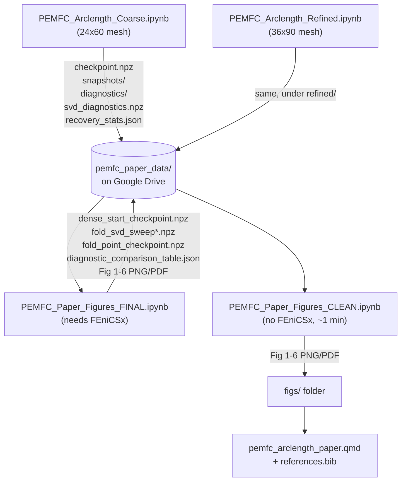

# PEMFC Pseudo-Arclength Continuation — Full Pipeline

This describes how all the notebooks and files in this project fit together, in the order
they need to run. If you only want the paper's figures and already have (or were given) the
`pemfc_paper_data/` folder, skip straight to **Stage 3**.

## Overview

## Stage 1 — Trace the branch (produces the raw continuation data)

Run **both** notebooks, ideally in **two separate Colab sessions** (two browser tabs, each its
own runtime) so the meshes trace in parallel rather than one after the other:

| Notebook | Mesh | What it writes |
|---|---|---|
| `PEMFC_Arclength_Coarse.ipynb` | 24×60 | `pemfc_paper_data/coarse/{checkpoint.npz, snapshots/, diagnostics/, svd_diagnostics.npz, recovery_stats.json}` |
| `PEMFC_Arclength_Refined.ipynb` | 36×90 | same, under `pemfc_paper_data/refined/` |

**This is the slow, unattended part** — hours to over a day depending on how often the
continuation stalls and needs the recovery ladder. Colab disconnects are normal here, not a
sign of failure; both notebooks' main automated cell is safe to just re-run (it resumes from
the last saved checkpoint automatically). If a cell dies, see each notebook's own recovery
guidance in the "Manual / Advanced Tools" section, or the more detailed Recovery Guide in
`PEMFC_Paper_Figures_FINAL.ipynb`.

**Stop condition**: each notebook's automated cell stops on its own once the branch reaches the
second stuck point and the recovery ladder is exhausted (this is expected — see the paper's
Sec. 4.5). At that point Stage 1 is done for that mesh.

## Stage 2 — Build the fold-point data and generate the paper's figures

Run `PEMFC_Paper_Figures_FINAL.ipynb` **after Stage 1 has produced data for both meshes**.
This notebook:
- Recomputes a dense display segment (fast)
- Runs the bulk SVD sweep + the fine resweep that actually locates the fold (the slowest part
  of this stage — can also need several interrupted/resumed attempts, especially on the refined
  mesh; see its built-in Recovery Guide)
- Diagnoses the fold itself at both meshes
- Generates all 6 figures and the diagnostic comparison table
- Downloads everything as a zip

Everything this notebook writes goes into the same `pemfc_paper_data/` folder from Stage 1, plus
figures into `/content/paper_figs/`.

## Stage 3 — Regenerate figures quickly (no FEniCSx, no long runs)

Once Stage 1 + 2 have been run at least once (by anyone, on any Drive account), the resulting
`pemfc_paper_data/` folder is all `PEMFC_Paper_Figures_CLEAN.ipynb` needs. It never re-traces
anything — pure `numpy`/`matplotlib` reading saved `.npz`/`.json` files, done in under a minute.

**This is the notebook to give students** if they just need the figures, not the full derivation.
See its own "Data required" section for how to get `pemfc_paper_data/` onto a different Google
account (Drive shortcut if shared, or zip download/upload otherwise) — that guidance applies to
the whole folder (Stage 1 + Stage 2 output together), not just the Stage 2 part.

## Stage 4 — The paper itself

`pemfc_arclength_paper.qmd` + `references.bib`, rendered with Quarto. Needs the `figs/` folder
(from Stage 2 or 3's download) placed alongside the `.qmd` file. Does not need Colab, Drive, or
any of the above notebooks — it only reads the already-generated figure files.

## Which notebook do I actually need to run?

- **"I want to reproduce everything from nothing"** → Stage 1 → Stage 2 → Stage 4 (Stage 3 is
  optional, for faster re-plotting later).
- **"I have `pemfc_paper_data/` already (shared or downloaded) and just want the figures"** →
  Stage 3 only.
- **"I want to edit the paper text/citations"** → Stage 4 only, using figures already on hand.
- **"Something looks wrong with the fold-point numbers / a stuck-point diagnosis"** → re-run the
  relevant part of Stage 1 (`diagnose_fold_point`, `check_outlet_flow`, the bistability test) or
  Stage 2 (`diagnose_fold_point` at the fold), not Stage 3 — Stage 3 can't recompute anything.

## Naming note

`PEMFC_Paper_Figures.ipynb` and `PEMFC_Paper_Figures_v2.ipynb` are the original exploration
notebooks (kept for full history — every bug found and fixed, every dead end tried). `FINAL` is
their cleaned-up, single-path successor and is what Stage 2 above refers to; there's no need to
run the exploration notebooks unless you're specifically interested in that history.
