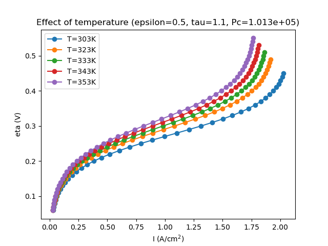
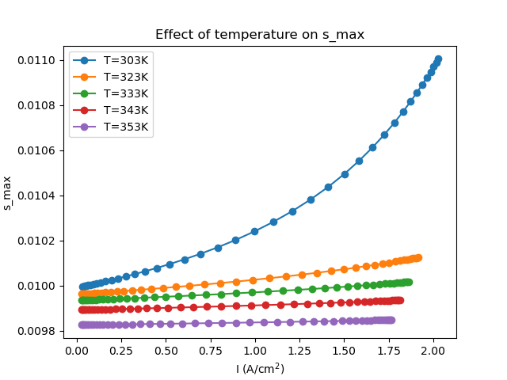
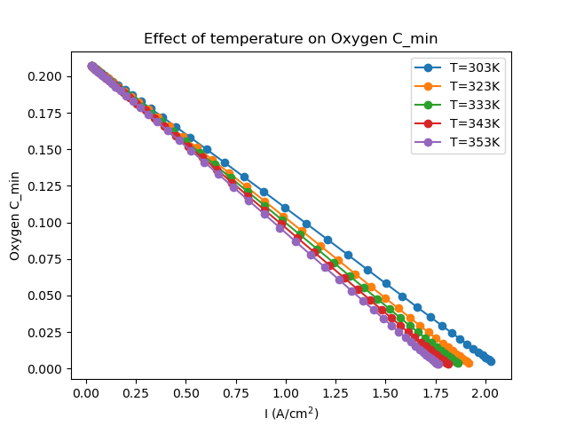
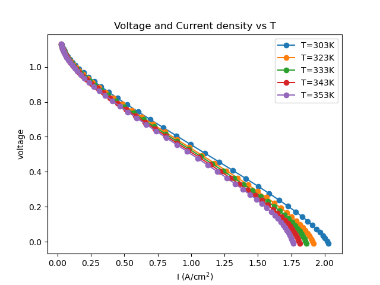
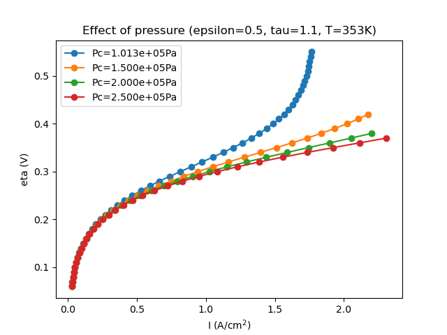
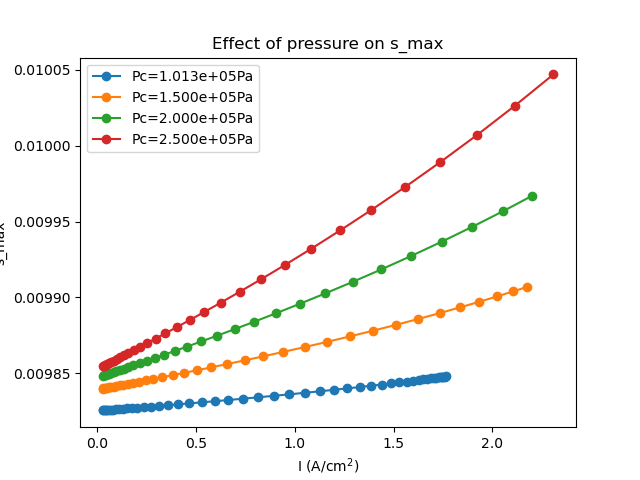
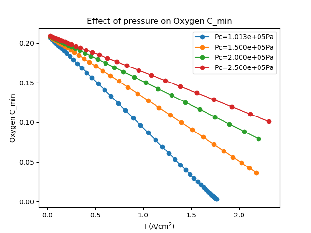
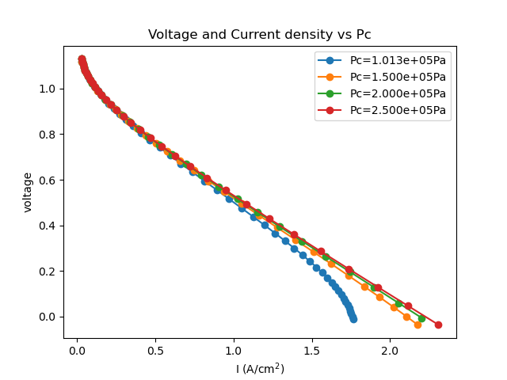

## Model Overview

- 2D PEMFC cathode: channel  + GDL, catalyst layer (CL) interface
- Coupled Navier–Stokes / Darcy momentum + O₂ and H₂O species transport
- M² mixture model: liquid saturation *s* embedded as a smooth algebraic function of water mass fraction (no separate *s* unknown)
- Solved monolithically: **(u, p, C_O2, C_H2O)** on one mixed function space

## Governing Equations

**Momentum (Navier–Stokes + Darcy switch)**

$$
(\mathbf{u}\cdot\nabla)\mathbf{u} - \nu\nabla^2\mathbf{u} + \nabla p
+ \chi_{\text{GDL}}\frac{\nu}{K}\mathbf{u} = 0, \quad \nabla\cdot\mathbf{u}=0
$$

**Species transport (O₂, H₂O)**

$$
\nabla\cdot(\rho D_{\text{eff}}\nabla C) - \nabla\cdot(\rho\,\gamma\, \mathbf{u}\, C) = 0
$$

**Tafel kinetics at CL**

$$
I = (1-s)\,I_{\text{ref}}\left(\frac{C_{O2}}{C_{O2,\text{ref}}}\right)
\exp\!\left(\frac{\alpha_c F \eta}{RT}\right)
$$

## Two-Phase Closure (M² Model)

- Saturation *s(C_H2O)*: smooth algebraic inverse (no lag, no Picard)
- Corey relative permeability: $k_{rl}=s^3,\ k_{rg}=(1-s)^3$
- Leverett *J*-function capillary pressure $\rightarrow$ capillary diffusion $D_{\text{cap}}$
- Bruggeman tortuosity: $D_{\text{eff}} = [\varepsilon(1-s)]^\tau D_g$

## Numerics

- PETSc SNES Newton, monolithic Jacobian (UFL auto-diff)
- **Bound-constrained Newton (`vinewtonrsls`)**: enforces $0 \le C \le 1$ on the raw DOFs — prevents Newton from overshooting into unphysical negative concentrations near the CL
- Adaptive η-continuation with step-halving (bisection) on solve failure
- Automatic fold detection: stop when bisection step size falls below tolerance

## Mesh / Domain

<!-- FIGURE: mesh screenshot -->
{width=70%}

## Parameter Sweep Design

| Parameter | Symbol | Values |
|---|---|---|
| Porosity | ε | fixed(0.5) |
| Bruggeman exponent | τ | fixed (1.1) |
| Temperature | T | swept (Psat(T) correlation) |
| Total pressure | P_c | swept |

- Psat(T): Table-2 empirical correlation (°C input, atm output → converted to Pa)
- ρ_g, ρ_O2 scale with P_c via ideal gas law

## Results — Polarization Curve

<!-- FIGURE: eta vs I for each swept parameter -->
{width=75%}

## Results — Saturation (Flooding)

<!-- FIGURE: s_max vs I -->
{width=75%}

## Results — Oxygen Depletion

<!-- FIGURE: C_min vs I -->
{width=75%}

## Results — Cell Voltage

<!-- FIGURE: V vs I -->
{width=75%}

---

# By pressure.

---

## Results — Polarization Curve

<!-- FIGURE: eta vs I for each swept parameter -->
{width=75%}

## Results — Saturation (Flooding)

<!-- FIGURE: s_max vs I -->
{width=75%}

## Results — Oxygen Depletion

<!-- FIGURE: C_min vs I -->
{width=75%}

## Results — Cell Voltage

<!-- FIGURE: V vs I -->
{width=75%}

## Key Findings

- Under the current GDL thickness / diffusivity combination, cell voltage reaches 0 **before** flooding onset — voltage-limited, not flooding-limited
- Confirms professor's high-η exploration notebook: this parameter regime shows no fold up to η ≈ 0.6–0.8
- Bound-constrained Newton was essential: unconstrained solves converge to unphysical negative-C states near CL

## Next Steps

- Must check with real data.

- Update $I_{ref}$ by parameter.
Now fixed on 0.01 
