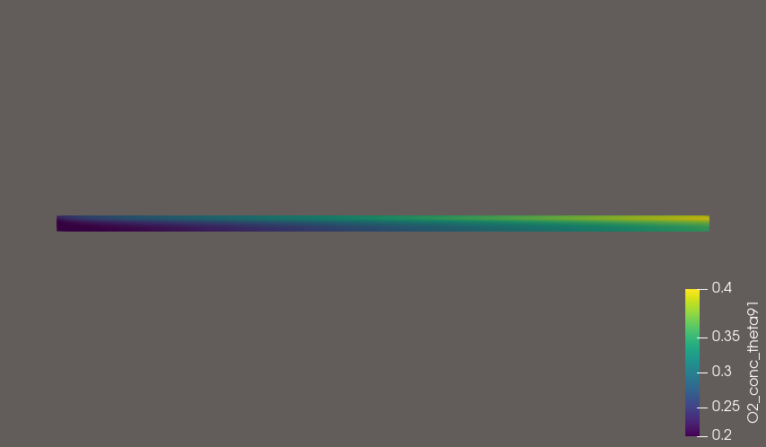

## Subject

- Expansion of the 1D reference work to 2D.
- Same assumptions as the reference

- Sweep $\eta$ over [0.05,0.075,0.1,0.15,0.2,0.25,0.3] V
- $\theta$ fixed at $91 ^ \circ$

---

## Mesh Generation with Gmsh GUI

- Higher mesh density at the GDL

{width=20%}

- GDL thickness $3 \times 10^{-4} m^2$
- Professor's work $2.5 \times 10^{-4} m^2$

- Channel Length $0.05m$
- Professor's work $0.002m$

---

## Verify velocity field

- Steady state; the momentum generation term is the Darcy term

---

{width=50%}
{width=50%}

---

## Set Parameters 

- Almost all parameters are the same as the reference

- Parameters not given
  * $\tau=1$
  * $\eta _{ohm}=\frac{IH_m}{\sigma _m}, \sigma _m =10 \frac{1}{\Omega m}$

---

- $I$ is not fixed.
- Computed from $I = (1-s)\, I_{ref}\, \frac{C_{g}^{O_2}}{C_{g,ref}^{O_2}}\, \exp\!\left(\frac{\alpha_c F}{RT}\eta\right)$

- $I_{ref}=100 \frac{A}{m^2}$

---

---

---

---

## Open Issue

- Oxygen concentration increases.......

---

- Log

At eta 0.05V
theta=91: converged reason=-6, iterations=16
  s range: [-0.0000, 0.0986]
  C range: [0.2110, 0.2142]
91 Average I  ,79.90494487646504
91 voltage 1.1420095055123534...

---

At eta 0.075V
theta=91: converged reason=-6, iterations=15
  s range: [-0.0000, 0.1242]
  C range: [0.2122, 0.2193]
91 Average I  ,180.48082396012325
91 voltage 1.1069519176039877...

---

At eta 0.1V
theta=91: converged reason=-6, iterations=15
  s range: [-0.0000, 0.1606]
  C range: [0.2149, 0.2311]
91 Average I  ,412.7256010741574
91 voltage 1.058727439892584...

---

At eta 0.15V
theta=91: converged reason=-6, iterations=16
  s range: [-0.0000, 0.3743]
  C range: [0.2335, 0.3073]
91 Average I  ,2094.1902091529264
91 voltage 0.8405809790847074...

---

At eta 0.2V
theta=91: converged reason=-6, iterations=15
  s range: [-0.0000, 0.8686]
  C range: [0.2433, 0.3376]
91 Average I  ,2710.5697820194964
91 voltage 0.7289430217980504...

---

At eta 0.25V
theta=91: converged reason=-6, iterations=9
  s range: [-0.0000, 0.9804]
  C range: [0.2434, 0.3378]
91 Average I  ,2714.5750849507135
91 voltage 0.6785424915049286...

---

At eta 0.3V
theta=91: converged reason=-6, iterations=9
  s range: [-0.0000, 0.9965]
  C range: [0.2434, 0.3378]
91 Average I  ,2714.589699606669
91 voltage 0.628541030039333...

---

- visualization

---