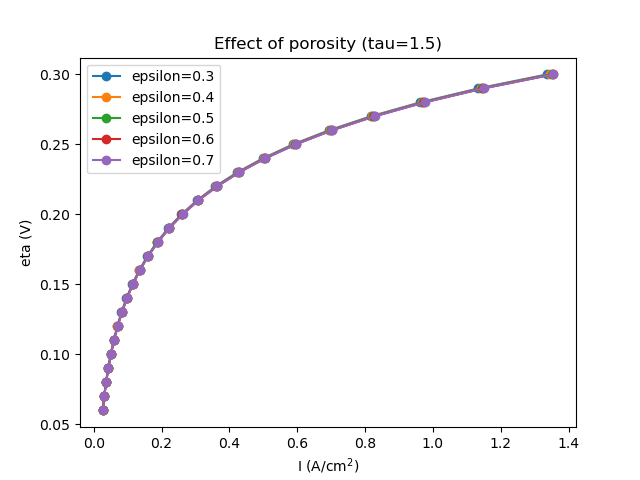
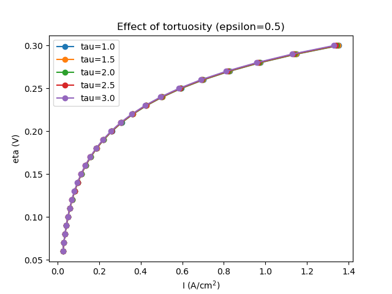

## Effect of Porosity Before Flooding

{width=85%}

- At low liquid saturation, the effect of porosity is relatively small.

---

## Effect of Tortuosity Before Flooding

{width=85%}

- At low liquid saturation, the effect of tortuosity is relatively small.

---

## Why Are the Effects Small at Low Saturation?

The effective diffusivity depends on porosity, tortuosity, and liquid saturation.

$$
D_{eff}=[\epsilon (1-s)]^{\tau} D_{O_2}
$$

Burggeman type

At low saturation, most pores are still available for gas transport.

$$
s \approx 0
\quad\Rightarrow\quad
(1-s)^n \approx 1
$$

Therefore, oxygen transport through the GDL is not yet strongly limited.

$$
C_{O_2,\mathrm{CL}}
\approx
C_{O_2,\mathrm{channel}}
$$

Although changes in $\varepsilon$ and $\tau$ change $D_{\mathrm{eff}}$,  
the GDL still provides sufficient oxygen to the catalyst layer.

**Therefore, their effects on cell performance remain small before significant flooding occurs.**

