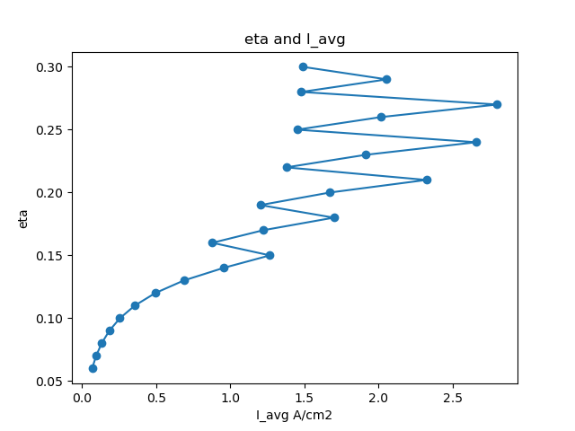
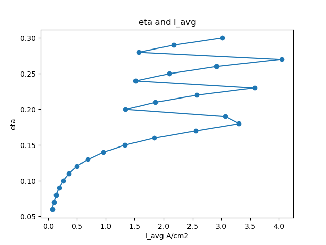
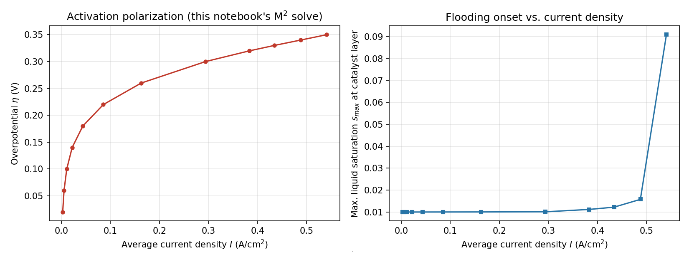
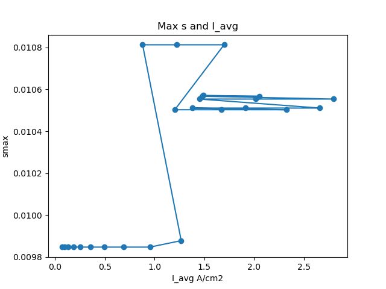
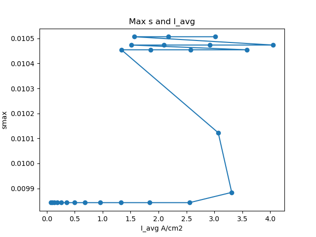
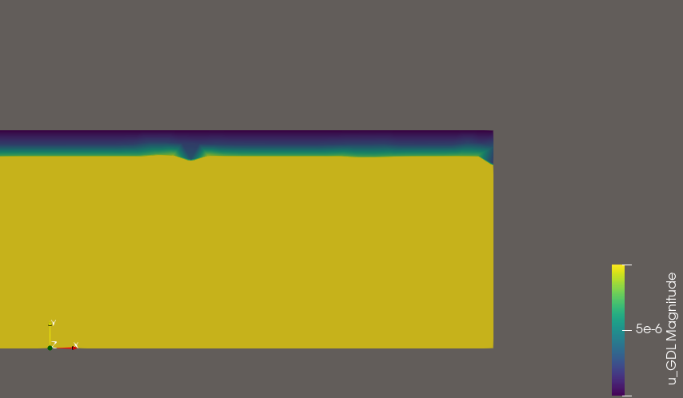
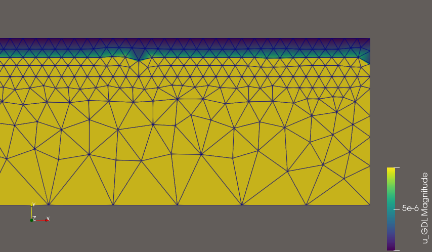

## Intro

- Before slide, Oxygen concentrate improve and it is wrong

- Find true concentrate on this slide

---

- Use

$$
s(C_W) = \min\!\Big(\, \mathrm{smooth\_max}\big(\mathrm{raw}(C_W),\,0\big),\; s_{\max}=0.99 \,\Big),
\qquad
$$

$$
\mathrm{raw}(C_W)=\frac{\rho_g\,(C_W - C_{g,\text{sat}})}
{\rho_l\,(1-C_W) + \rho_g\,(C_W - C_{g,\text{sat}})}
$$

---

## Meshes

- 1st Mesh:

Info    : 15 entities

Info    : 507 nodes

Info    : 1112 elements

- 2nd Mesh

Info    : 15 entities

Info    : 3897 nodes

Info    : 8292 elements

- Propessor's mesh is 1440 element.

---

---

- 1st mesh eta and I

---

- 2nd mesh eta and I

---

- Professor's

---

- 1st mesh eta and maximum s

---

- 2nd mesh eta and maximum s

---

- GDL velocity..

{width=50%}
{width=50%}

---

