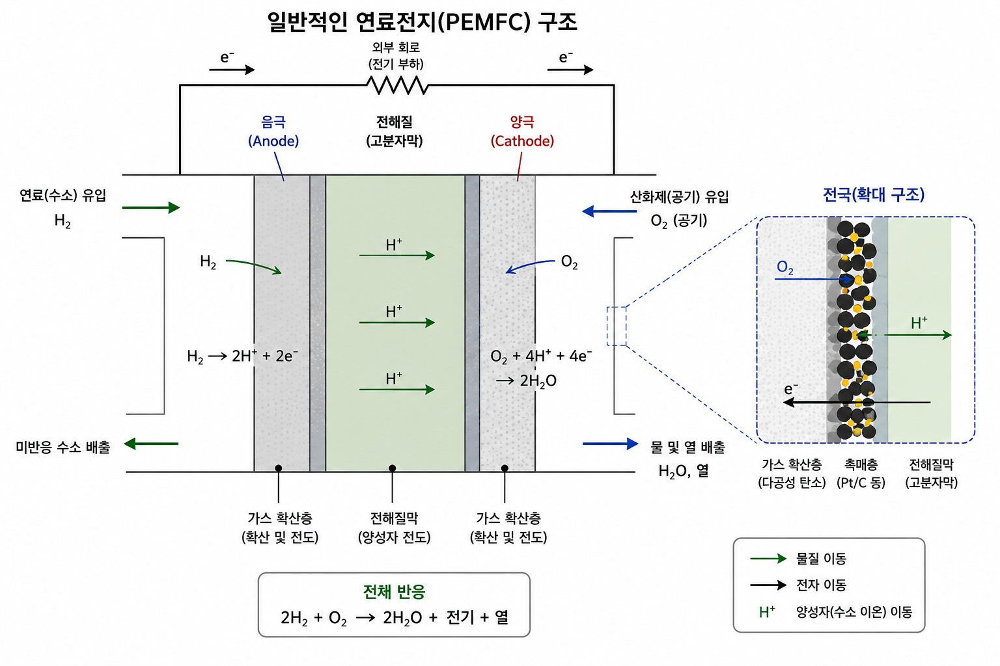

 

# Theoreom of Fuell Cell and Flooding

Refer to :

[1]Ryan O'Hayre,Suk-Won Cha, Whitney Colella,Fritz B.Prinz,Hanteemedia (2008) $\textit{\langle FUEL CELL Fundamentals\rangle}$, Korean Trans(Suk-Won Cha Trans.,),Hantee media

[2]Frano Barbir (2005), $\textit{\langle PEM FUel Cells -Theory and Practice-\rangle}$ ,Korean Trans(Young-Ill Cho, Kee-Suk Cha),Bookshill

---

## $H_2$ combustion reaction

Anode:

$$
H_2 \rightarrow 2H^{+}+2e^{-} $$

Cathode: 

$$
\frac{1}{2} O_2+2H^{+} \rightarrow H_2O $$

---

## PEMFC

{width=50%}

PEMFC:Polymer Electrolyte Membrane Fuel Cell

Use thin memebrane to electrolyte. Proton rolls on carry charge.

---

### Fuel Cell step

1. Mass transfer to fuel cell inner.
2. Electro-chemical reaction
3. Ion transport on electrolyte and electrone transpot on outer cycle.
4. Byproduct remove

---

#### Step 1 Mass transfer to fuelcell inner

For operate fuel cell well, Fuel and Oxidation must input sufficently.
Use flow field plate for efficent on Reactant transport.
Good flow field plate has good channel and groove for diffusion gas.

---

#### Step 2 Electro - Chemical reaction

When reactant arrive on electrode reaction goes on.

Biggest limits on design battery.

---

#### Step 3 Ion and electrone transfer

For charge balace, ion and electrone move.

---

#### Step 4 Byproduct release

Fuel cell make byproduct.

In case of hydrogen fuel cell, byproduct is water.

Flooding by water makes 

---

## Fuel cell perfomance

loss of fuel cell :
* activation loss : loss of chemical reaction
* ohmic loss : loss of conductivity
* concentration loss : loss of mass transfer

So fuel cell's real voltage is

$$
V=E_{thermo}-\eta_{act}-\eta_{ohmic}-\eta_{conc} $$

---

## Nernst equation

Electrone energy out like $W=EQ$, E is volatage(V;J/C), Q is charge(C)

Use Fareday constant $F$, $N_A$ s electrone's charge, $Q=nF$

$W=nF E$ System's free energy $-\Delta G=W$, $\Delta G=-nF\Delta E$

---

#### voltage by temperature

$dG=Vdp-SdT$  Constant pressure

$$
(\frac{dG}{dT})_P =-S $$

$$
\Delta G=-nF\Delta E, (\frac{dE}{dT})_P=\frac{S}{nF} $$

$$
E_T=E^0+\frac{\Delta S}{nF}(T-T_0) $$

---

#### voltage by concentrate

Chemical potential $\mu^{\alpha}_i=(\frac{\partial G}{\partial n_i}) _{T,P}$
$\mu^{\alpha}_i$ is specise $i$'s chmical potential at phase $\alpha$.
So $dG=\sum_i \mu_i dn_i$

$\mu=\mu^0 _i +RT\ln a_i$, $a_i$ is activity. Effective concentrate.

---

- Example reaction:

$$
A+bB \rightarrow mM+nN $$

$$
\Delta G= m{\mu^0_M+RT\ln a_M}+n{\mu^0_N+RT\ln a_N}-{\mu^0_A+RT\ln a_A}-b{\mu^0_B+RT\ln a_B} $$

$$
\Delta G={m\mu^0_M+n\mu^0_N-\mu^0_A-b\mu^0_B}+RT \ln \frac{a^m_M a^n_N}{a_A a^b_B} $$

$$
\Delta G=\Delta G^0 +RT \ln \frac{a^m_M a^n_N}{a_A a^b_B} $$

$$
\Delta E=\Delta E^0-\frac{RT}{nF}\ln \frac{a^m_M a^n_N}{a_A a^b_B} $$

---

Generalize log term,

$$
\Delta E=\Delta E^0-\frac{RT}{nF}\ln \frac{\Pi a^{\nu_i}_{products}}{\Pi a^{\nu_i} _{reactans}} $$

---

## Bulter Volmer equation

This equation is about current density change.

$$
j_1=j_0\exp (\alpha n F \eta /RT) $$

$$
j_2=j_0 \exp(-(1-\alpha)nF\eta /RT) $$

Fure current density 

$$
j=j_0(\exp(-(1-\alpha)nF\eta /RT)-\exp (\alpha n F \eta /RT)) $$

- Equilibrium current density $j_0$
- $\alpha$ is transfer coffiecent
-  $\eta$ is Overpotential

---

## Governing equation

1. Mass conservation

$$
   \frac{\partial}{\partial t}  \rho +\nabla \cdot ( \rho u) =0 $$

2. Momentum conservation; Brinkman equation
   
$$
   \frac{\partial(\rho u)}{\partial t} +\rho (u \cdot \nabla )u=-\nabla P +\nabla(\mu \nabla u) -\frac{\mu}{\kappa}u $$

3. Species conservation
   
$$
   \frac{\partial}{\partial t}(C_i)+\nabla \cdot (uC_i)-\nabla \cdot (D_{eff} \nabla C_i)=Gen $$

4. Energy conservation

$$
   (\rho c_p)_ {eff}  \frac{\partial T}{\partial t} +(\rho c_p)_ {eff}(u \cdot \nabla T)=\nabla \cdot (k_ {eff} \nabla T)+S_e $$

5. Charge conservation

$$
   \nabla \cdot i_ {electrone} = -\nabla \cdot i_ {ion} =j $$

6. Electrochemical reaction

$$
    j=j_0(\exp(-(1-\alpha)nF\eta /RT)-\exp (\alpha n F \eta /RT)) $$
   

---

